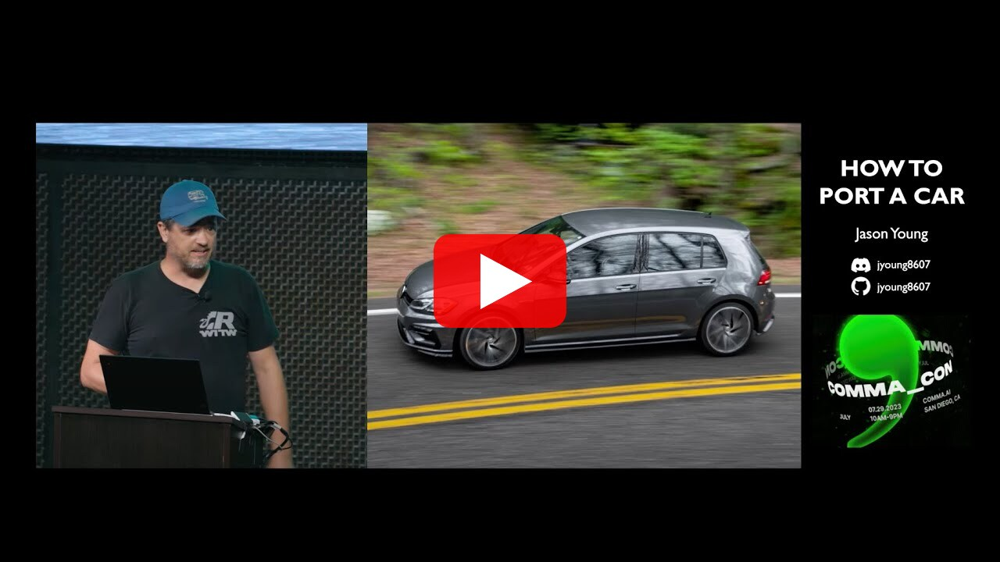

<div align="center" style="text-align: center;">

<h1>opendbc</h1>
<p>
  <b>opendbc is a Python API for your car.</b>
  <br>
  Control the gas, brake, steering, and more. Read the speed, steering angle, and more.
</p>

<h3>
  <a href="https://docs.comma.ai">Docs</a>
  <span> · </span>
  <a href="https://github.com/commaai/openpilot/blob/master/docs/CONTRIBUTING.md">Contribute</a>
  <span> · </span>
  <a href="https://discord.comma.ai">Discord</a>
</h3>

[](LICENSE)
[](https://x.com/comma_ai)
[](https://discord.comma.ai)

<br>
<a href="https://www.youtube.com/watch?v=XxPS5TpTUnI&t=142s">
  
</a>
<br>
<em>How to Port a Car — Jason Young, COMMA_CON 2023</em>

</div>

---

Most cars since 2016 can be electronically controlled — steering, gas, and brakes — thanks to built-in [LKAS](https://en.wikipedia.org/wiki/Lane_departure_warning_system#Lane_keeping_and_next_technologies) and [ACC](https://en.wikipedia.org/wiki/Adaptive_cruise_control). The goal of opendbc is to support every single one of them. Most car support comes from the community. **If you know Python, you can port your car.**

### Bounties

Every car port is eligible for a bounty:
* **$2000** — [New car brand / platform port](https://github.com/orgs/commaai/projects/26/views/1?pane=issue&itemId=47913774)
* **$300** — [Reverse engineering a new actuation message](https://github.com/orgs/commaai/projects/26/views/1?pane=issue&itemId=73445563)
* **$250** — [New car model port](https://github.com/orgs/commaai/projects/26/views/1?pane=issue&itemId=47913790)

Higher bounties for popular cars at [comma.ai/bounties](https://comma.ai/bounties).

---

## Quick Start

```bash
git clone https://github.com/commaai/opendbc.git
cd opendbc

# all-in-one: install, build, lint, and test (same as CI)
./test.sh

# or run individual steps
pip3 install -e .[testing,docs]  # install dependencies
scons -j8                        # build
pytest .                         # test
lefthook run lint                # lint
```

[`examples/`](examples/) contains small programs to read car state and control steering, gas, and brakes.
[`examples/joystick.py`](examples/joystick.py) lets you control a car with a joystick.

### Project Structure
* [`opendbc/dbc/`](opendbc/dbc/) — [DBC](https://en.wikipedia.org/wiki/CAN_bus#DBC_(CAN_Database_Files)) files
* [`opendbc/can/`](opendbc/can/) — library for parsing and building CAN messages from DBC files
* [`opendbc/car/`](opendbc/car/) — high-level Python library for interfacing with cars
* [`opendbc/safety/`](opendbc/safety/) — functional safety for all supported cars

## How to Port a Car

If your car's brand already has support, porting a new model can be as simple as adding a fingerprint and testing. Even a brand-new brand port is straightforward — it's all Python.

### 1. Connect to the Car

Plug in a [comma four](https://comma.ai/shop/comma-four) with a [car harness](https://comma.ai/shop/car-harness). The harness connects to two CAN buses and lets you send actuation messages.

* If a harness for your car exists, buy it from [comma.ai/shop](https://comma.ai/shop).
* Otherwise, start with a [developer harness](https://comma.ai/shop) and crimp on the connector you need.

### 2. Reverse Engineer CAN Messages

Record a route with interesting events — enable LKAS and ACC, turn the wheel to both extremes, etc. Then explore the data in [cabana](https://github.com/commaai/openpilot/tree/master/tools/cabana).

### 3. Write the Port

A car port lives in `opendbc/car/<brand>/`:

| File | Purpose |
|------|---------|
| `carstate.py` | Parse car state from CAN using the DBC file |
| `carcontroller.py` | Send CAN messages to control the car |
| `<brand>can.py` | Helpers to build CAN messages |
| `fingerprints.py` | ECU firmware versions for identifying car models |
| `interface.py` | High-level class for interfacing with the car |
| `radar_interface.py` | Parse radar data |
| `values.py` | Enumerate supported cars for the brand |

If the brand already exists, most of these files are already written — you just need to add your car's fingerprint and make any model-specific adjustments.

### 4. Tune

Use the [longitudinal maneuvers](https://github.com/commaai/openpilot/tree/master/tools/longitudinal_maneuvers) tool to evaluate and tune your car's longitudinal control.

## Contributing

All development is coordinated on GitHub and [Discord](https://discord.comma.ai) (`#dev-opendbc-cars` channel). Jump in and ask questions — the community is friendly.

### Roadmap

Short term
- [ ] `pip install opendbc`
- [ ] 100% type coverage
- [ ] 100% line coverage
- [ ] Make car ports easier: refactors, tools, tests, and docs
- [ ] Expose the state of all supported cars better: [#1144](https://github.com/commaai/opendbc/issues/1144)

Longer term
- [ ] Extend support to every car with LKAS + ACC interfaces
- [ ] Automatic lateral and longitudinal control/tuning evaluation
- [ ] Auto-tuning for [lateral](https://blog.comma.ai/090release/#torqued-an-auto-tuner-for-lateral-control) and longitudinal control
- [ ] [Automatic Emergency Braking](https://en.wikipedia.org/wiki/Automated_emergency_braking_system)

## FAQ

***How do I use this?*** A [comma four](https://comma.ai/shop/comma-four) is the best way to run and develop opendbc and openpilot.

***Which cars are supported?*** See the [supported cars list](docs/CARS.md).

***Can I add support for my car?*** Yes! Read the [porting guide](#how-to-port-a-car) above.

***Which cars can be supported?*** Any car with LKAS and ACC. [More info](https://github.com/commaai/openpilot/blob/master/docs/CARS.md#dont-see-your-car-here).

***How does this work?*** We designed hardware to replace your car's built-in lane keep and adaptive cruise. [Watch this talk](https://www.youtube.com/watch?v=FL8CxUSfipM) for a deep dive.

<details>
<summary><h2>Safety Model</h2></summary>

When a [panda](https://comma.ai/shop/panda) powers up with [opendbc safety firmware](opendbc/safety), by default it's in `SAFETY_SILENT` mode. While in `SAFETY_SILENT` mode, the CAN buses are forced to be silent. In order to send messages, you have to select a safety mode. Some of safety modes (for example `SAFETY_ALLOUTPUT`) are disabled in release firmwares. In order to use them, compile and flash your own build.

Safety modes optionally support `controls_allowed`, which allows or blocks a subset of messages based on a customizable state in the board.

</details>

<details>
<summary><h2>Code Rigor</h2></summary>

The safety firmware provides and enforces [openpilot safety](https://github.com/commaai/openpilot/blob/master/docs/SAFETY.md). [CI regression tests](https://github.com/commaai/opendbc/actions) include:
* Static analysis by [cppcheck](https://github.com/danmar/cppcheck/) with [MISRA C:2012](https://misra.org.uk/) checking. See [current coverage](opendbc/safety/tests/misra/coverage_table).
* Strict compiler flags: `-Wall -Wextra -Wstrict-prototypes -Werror`
* [Unit tests](opendbc/safety/tests) for each supported car variant
* [Mutation testing](opendbc/safety/tests/misra/test_mutation.py) on MISRA coverage
* 100% line coverage on safety unit tests
* [ruff](https://github.com/astral-sh/ruff) linter and [ty](https://github.com/astral-sh/ty) on the car interface library

</details>

<details>
<summary><h3>Terms</h3></summary>

* **port**: integration and support of a specific car
* **lateral control**: steering control
* **longitudinal control**: gas/brakes control
* **fingerprinting**: automatic process for identifying the car
* **[LKAS](https://en.wikipedia.org/wiki/Lane_departure_warning_system)**: lane keeping assist
* **[ACC](https://en.wikipedia.org/wiki/Adaptive_cruise_control)**: adaptive cruise control
* **[harness](https://comma.ai/shop/car-harness)**: car-specific hardware to attach to the car and intercept ADAS messages
* **[panda](https://github.com/commaai/panda)**: hardware used to get on a car's CAN bus
* **[ECU](https://en.wikipedia.org/wiki/Electronic_control_unit)**: computers or control modules inside the car
* **[CAN bus](https://en.wikipedia.org/wiki/CAN_bus)**: a bus that connects the ECUs in a car
* **[cabana](https://github.com/commaai/openpilot/tree/master/tools/cabana#readme)**: tool for reverse engineering CAN messages
* **[DBC file](https://en.wikipedia.org/wiki/CAN_bus#DBC)**: definitions for messages on a CAN bus
* **[openpilot](https://github.com/commaai/openpilot)**: an ADAS system for cars supported by opendbc
* **[comma](https://github.com/commaai)**: the company behind opendbc
* **[comma four](https://comma.ai/shop/comma-four)**: the hardware used to run openpilot

</details>

### Resources

* [*How Do We Control The Car?*](https://www.youtube.com/watch?v=nNU6ipme878&pp=ygUoY29tbWEgY29uIDIwMjEgaG93IGRvIHdlIGNvbnRyb2wgdGhlIGNhcg%3D%3D) by [@robbederks](https://github.com/robbederks) — COMMA_CON 2021
* [*How to Port a Car*](https://www.youtube.com/watch?v=XxPS5TpTUnI&t=142s&pp=ygUPamFzb24gY29tbWEgY29u) by [@jyoung8607](https://github.com/jyoung8607) — COMMA_CON 2023
* [commaCarSegments](https://huggingface.co/datasets/commaai/commaCarSegments): CAN data from 300+ car models
* [cabana](https://github.com/commaai/openpilot/tree/master/tools/cabana#readme): reverse engineer CAN messages
* [can_print_changes.py](https://github.com/commaai/openpilot/blob/master/selfdrive/debug/can_print_changes.py): diff CAN bus across drives
* [longitudinal maneuvers](https://github.com/commaai/openpilot/tree/master/tools/longitudinal_maneuvers): evaluate and tune longitudinal control
* [opendbc data](https://commaai.github.io/opendbc-data/): longitudinal maneuver evaluations

## Come work with us — [comma.ai/jobs](https://comma.ai/jobs)

comma is hiring engineers to work on opendbc and [openpilot](https://github.com/commaai/openpilot). We love hiring contributors.
